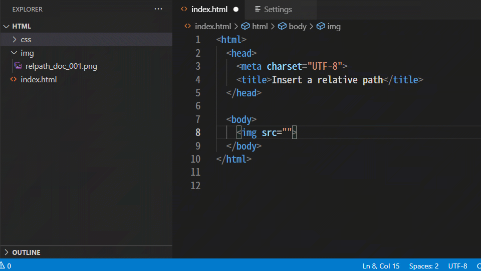

# Insert Relative Path README

----

[日本語は下に記載]

## English

### Overview

* This extension inserts a relative path to the specified file in Explorer
* You can insert any string (even Snippet) before or after the relative path.
* For example, if you define the format of the string to be inserted as `<link rel="stylesheet" href="{RELPATH}">`, you can easily insert a line to load a css file.

### Features

For more information about each function, please refer to the following web page.

* [Top Page](https://tatsuyanakamori.github.io/vscode-InsertRelativePath/)
* [Overview](https://tatsuyanakamori.github.io/vscode-InsertRelativePath/en/sec01_overview/index.html)
* [How to use](https://tatsuyanakamori.github.io/vscode-InsertRelativePath/en/sec01_overview/howToUse.html)
* [Details of each feature](https://tatsuyanakamori.github.io/vscode-InsertRelativePath/en/sec02_functions/index.html)
* [Known problems](https://tatsuyanakamori.github.io/vscode-InsertRelativePath/en/sec03_other/knownIssues.html)
* [Release Notes](https://tatsuyanakamori.github.io/vscode-InsertRelativePath/en/sec03_other/releaseNotes.html)
* [License](https://tatsuyanakamori.github.io/vscode-InsertRelativePath/en/sec03_other/license.html)

### Donations

If this tool saves you time, please donate to the development of the tool.

* [GitHub Sponsor](https://github.com/sponsors/TatsuyaNakamori)

------------------------------------------------------------------------

## Japanese

### 概要

* このエクステンションは、Explorerで指定したファイルまでの相対パスを挿入します
* 相対パスの前後に任意の文字列(Snippetにも対応)を挿入することができます
* 例えば、挿入する文字列のフォーマットを `<link rel="stylesheet" href="{RELPATH}">` のように定義しておけば、簡単にcssファイルを読み込むための行を挿入できます。

### 機能

各機能の詳細は、次のWebページを参照してください。

* [トップページ](https://tatsuyanakamori.github.io/vscode-InsertRelativePath/)
* [概要](https://tatsuyanakamori.github.io/vscode-InsertRelativePath/jp/sec01_overview/index.html)
* [使い方](https://tatsuyanakamori.github.io/vscode-InsertRelativePath/jp/sec01_overview/howToUse.html)
* [各機能の詳細](https://tatsuyanakamori.github.io/vscode-InsertRelativePath/jp/sec02_functions/index.html)
* [既知の問題](https://tatsuyanakamori.github.io/vscode-InsertRelativePath/jp/sec03_other/knownIssues.html)
* [更新履歴](https://tatsuyanakamori.github.io/vscode-InsertRelativePath/jp/sec03_other/releaseNotes.html)
* [ライセンス](https://tatsuyanakamori.github.io/vscode-InsertRelativePath/jp/sec03_other/license.html)

### 寄付

このツール開発の支援をお願いします。

* [GitHub Sponsor](https://github.com/sponsors/TatsuyaNakamori)
